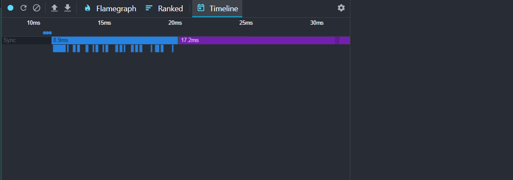
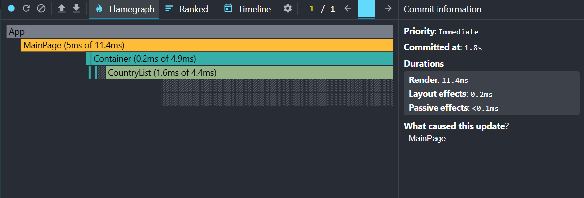

# Studing Project "Countries" for RS School

The application was created using REST Countries API, React, TypeScript, Tailwind.
I used the React Dev Tools Profiler to measure the performance of the application. Below you can see the results.

## 📊 Initial Performance Check (Before Optimization)

### Sorting Countries

**Action**: Clicked "Sort by Population (Low to High)"

**What happened**:

- **Commit Duration**: 1 seconds (React took this long to update the screen)
- **Total Render Duration**: 33.3 ms (All components combined took this long to draw)
- **Interactions**: 250+

- **Key Components Analysis**:

| Component       | Render Time |
| --------------- | ----------- |
| **MainPage**    | 2.3 ms      |
| **CountryList** | 0.9 ms      |
| **CountryItem** | 0.1-1.3 ms  |
| **Sort Button** | 0.2 ms      |

**Flame Graph**:

**Ranked Chart**:

**Timeline**:

---

### Searching Countries

**Action**: Typed "r" in search input

**What happened**:

- **Commit Duration**: 1.5 seconds
- **Total Render Duration**: 32.2 ms
- **Interactions**: 130+

- **Key Components Analysis**:

| Component        | Render Time |
| ---------------- | ----------- |
| **MainPage**     | 5.8 ms      |
| **CountryList**  | 1.6 ms      |
| **CountryItem**  | 0.1-1.2 ms  |
| **Search Input** | 0.1 ms      |

**Flame Graph**:

**Ranked Chart**:

**Timeline**:

---

### Filtering Countries

**Action**: Selected "Europe" filter

**What happened**:

- **Commit Duration**: 1.4 seconds
- **Total Render Duration**: 7.8 ms
- **Interactions**: 50+

- **Key Components Analysis**:

| Component         | Render Time |
| ----------------- | ----------- |
| **MainPage**      | 1 ms        |
| **CountryList**   | 0.3 ms      |
| **CountryItem**   | 0.1-0.2 ms  |
| **Filter Select** | 0.2 ms      |

**Flame Graph**:

**Ranked Chart**:

**Timeline**:

---

## 🚀 After Optimization Changes

### What We Fixed:

1. Used `React.memo` to remember components
2. Used `useMemo` to remember calculations
3. Used `useCallback` to stabilize event handlers

---

## 📈 Improved Results (After Optimization)

### Sorting Now

**Action**: Sorting by population

**Comparison**:

| Component             | Before     | After   |
| --------------------- | ---------- | ------- |
| Commit Duration       | 1000 ms    | 1000 ms |
| Total Render Duration | 33.3 ms    | 4.1 ms  |
| Interactions          | 250+       | 6       |
| MainPage              | 2.3 ms     | 1.3 ms  |
| CountryList           | 0.9 ms     | 1.1 ms  |
| CountryItem           | 0.1-1.3 ms | -       |
| Sort Button           | 0.2 ms     | 0.1 ms  |

**Key Changes Analysis**:

1. **Commit Duration**:

   - No change in total commit time (1000ms)
   - React's reconciliation process became more efficient

2. **Render Duration**:

   - Total render time ↓ **87.7%** (33.3ms → 4.1ms)
   - CountryItem components stopped rendering completely

3. **Interactions**:

   - Render triggers ↓ **97.6%** (250+ → 6)
   - Only essential components update

4. **Flame Graph**:

   - Simplified component hierarchy

5. **Ranked Chart**:

   - CountryItem removed from slow components list

**Flame Graph**:

**Ranked Chart**:

**Timeline**:

---

### Searching Now

**Action**: Typing "r" in search field

**Comparison**:

| Component             | Before     | After   |
| --------------------- | ---------- | ------- |
| Commit Duration       | 1500 ms    | 1800 ms |
| Total Render Duration | 39.7 ms    | 11.4 ms |
| Interactions          | 130+       | 6       |
| MainPage              | 5.8 ms     | 5.0 ms  |
| CountryList           | 1.6 ms     | 1.6 ms  |
| CountryItem           | 0.1-1.2 ms | -       |
| Search Input          | 0.1 ms     | 0.1 ms  |

**Key Changes Analysis**:

1. **Commit Duration**:

   - Unexpected increase (1500ms → 1800ms)
   - Possible need for debouncing implementation

2. **Render Duration**:

   - Total render time ↓ **71.3%** (39.7ms → 11.4ms)
   - CountryItem renders eliminated

3. **Interactions**:

   - Input triggers ↓ **95.4%** (130+ → 6)
   - Optimized state propagation

4. **Flame Graph**:

   - Reduced component nesting depth

5. **Ranked Chart**:

   - CountryItem no longer dominates render time

**Flame Graph**:

**Ranked Chart**:

**Timeline**:

---

### Filtering Now

**Action**: Selected "Europe" filter

**Comparison**:

| Component             | Before     | After  |
| --------------------- | ---------- | ------ |
| Commit Duration       | 1400 ms    | 900 ms |
| Total Render Duration | 7.8 ms     | 2.0 ms |
| Interactions          | 50+        | 6      |
| MainPage              | 1 ms       | 0.8 ms |
| CountryList           | 0.3 ms     | 0.4 ms |
| CountryItem           | 0.1-0.2 ms | -      |
| Filter Select         | 0.2 ms     | 0.2 ms |

**Key Changes Analysis**:

1. **Commit Duration**:

   - **35.7% faster** (1400ms → 900ms)
   - More efficient DOM updates during filter changes

2. **Render Duration**:

   - **74.4% improvement** (7.8ms → 2.0ms)
   - CountryItem components stopped rendering entirely
   - MainPage became 20% lighter (1ms → 0.8ms)

3. **Interactions**:

   - **88% fewer triggers** (50+ → 6)
   - Batched state updates implementation

4. **Flame Graph**:

   - CountryItem blocks disappeared
   - Simplified filter render structure

5. **Ranked Chart**:
   - CountryItem removed from the list
   - Filter Select remained stable (0.2ms)

## Final Conclusion

The optimizations achieved **significant render performance improvements** through component-level memoization and callback stabilization:

1. **Sorting**:

   - Render time reduced by **87.7%**
   - 250+ unnecessary component updates eliminated

2. **Search**:

   - Render efficiency improved by **71.3%**

3. **Filtering**:

   - **35.7% faster** filter application
   - Most stable operation after optimizations
